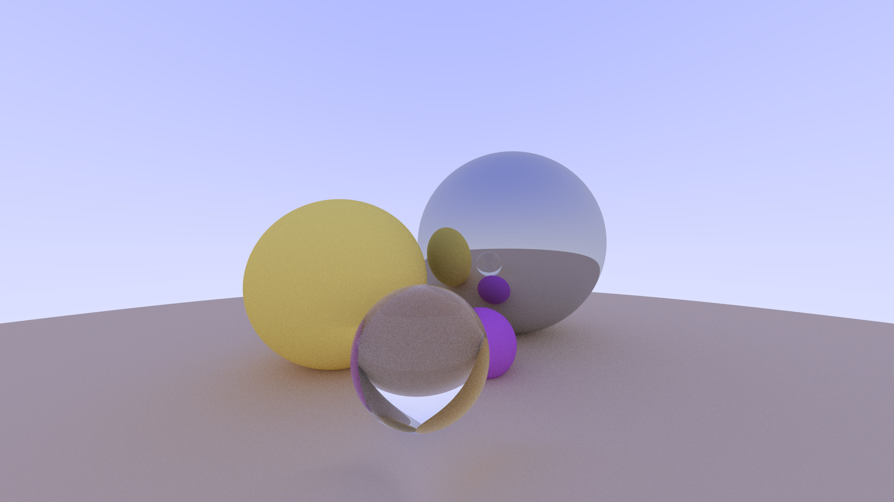
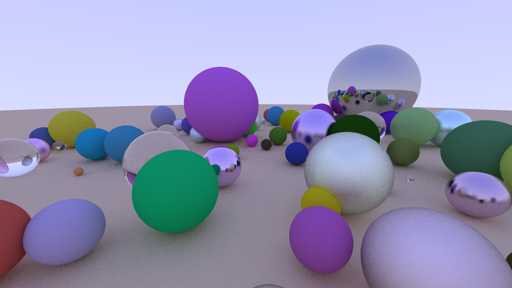
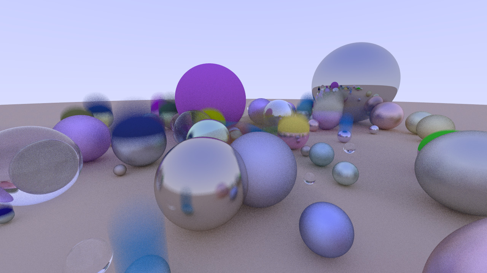

# C++ Ray Tracer
This is a custom ray tracer made with C++ that renders spheres with different colors and properties.

## Features
- **Rendering Capabilities**:
    - Supports rendering of spheres with:
        - Matte material
        - Metal with adjustable roughness
        - Dielectrics with refraction
    - Anti-aliasing
    - Motion blur
- **BVH (Bounding Volume Hierarchy)**:
    - Allows for faster rendering
- **Camera Settings**:
    - Adjustable field of view, position, and depth of field

## Output
The output is a .ppm image with rbg values for each pixel.

Image resolution, sample size, and blur can all be controlled inside the program.

Sample renders:

1920x1080 render showing the different materials at 50 samples/pixel

1280x720 render

1280x720 render with motion blur on some balls